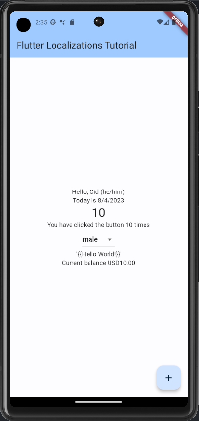
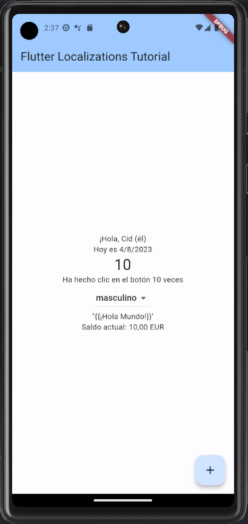

  # Flutter Localization/Internationalization Tutorial
  
  This is a simple practice project to add multi-language support to an Android-based Flutter/Dart mobile app.
  
  ## Table of Contents
  
  * [Installation](#installation)
  * [Built With](#built)
  * [Usage Information](#usage)
  * [Authors & Acknowledgements](#credits)
  * [Contact](#questions)
  
  ## Installation
  After cloning the repository and running "flutter pub get" to install all dependencies, ensure Android Studio is installed and launch an Android emulator. Create a .env file with your TMDB api key under the variable API_KEY. Press F5 to run the application debug mode.

  ## Built With
  * Flutter
  * Dart
  * Android Studio
  * flutter_localizations
  * intl
  
  ## Usage Information

  This application is a practice app only and does not provide real functionality. 
     
  
  ## Authors & Acknowledgements
  
  This application was built following the flutter accessibility documentation that can be found at [this](https://docs.flutter.dev/accessibility-and-localization/internationalization) link. 

  Special thanks to 2iiz's answer [here](https://stackoverflow.com/questions/72228015/formatexception-unexpected-character-at-line-439-character-1-with-arb-file) on debugging ARB files. 

  Made by [TOVTC](https://github.com/TOVTC).

  ## Questions?
  Contact repository author via [GitHub](https://github.com/TOVTC). 
    